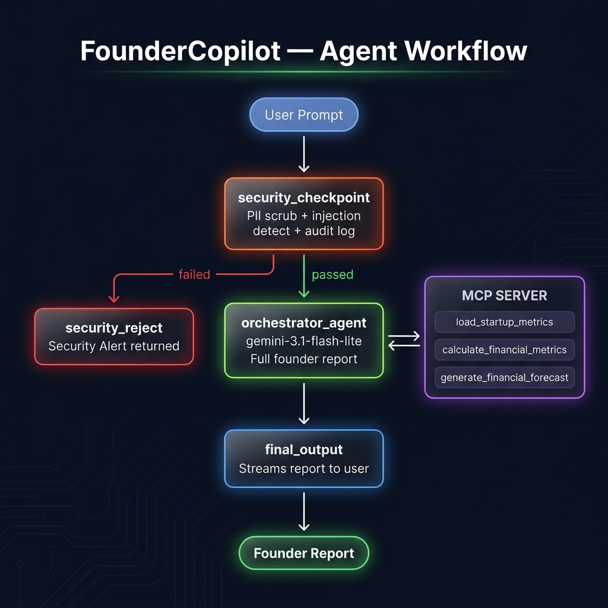
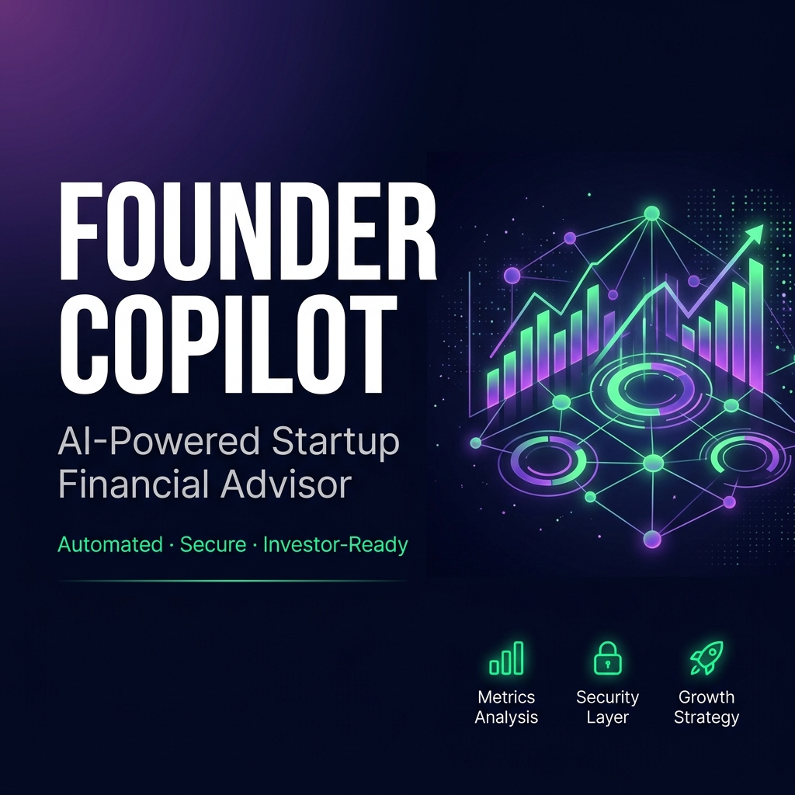

# FounderCopilot 🚀

> **AI-powered startup advisor** — analyze your metrics, surface risks, and get an investor-ready growth strategy in seconds.

Built with [Google ADK](https://google.github.io/adk-docs/) · Multi-Agent Workflow · MCP Server · Security Checkpoint

---

## 📋 Prerequisites

| Tool | Version | Link |
|---|---|---|
| Python | 3.11+ | [python.org](https://python.org) |
| uv | Any | [Install uv](https://docs.astral.sh/uv/getting-started/installation/) |
| Gemini API Key | — | [aistudio.google.com/apikey](https://aistudio.google.com/apikey) |

---

## 🚀 Quick Start

```bash
git clone <your-repo-url>
cd founder-copilot
cp .env.example .env   # add your GOOGLE_API_KEY
make install
make playground        # opens UI at http://localhost:18081
```

---

## 🏗️ Architecture

```
User Prompt
    │
    ▼
┌──────────────────────┐
│  security_checkpoint │  ◄─ PII scrub + injection detect + audit log
└──────────┬───────────┘
           │ passed / failed
     ┌─────┴──────┐
     │            │
     ▼            ▼
┌──────────┐  ┌─────────────┐
│ security │  │ orchestrator│ ◄─ gemini-3.1-flash-lite
│  _reject │  │   _agent    │
└──────────┘  └──────┬──────┘
                     │  calls tools
                     ▼
              ┌─────────────────────────────────┐
              │         MCP Server              │
              │  • load_startup_metrics         │
              │  • calculate_financial_metrics  │
              │  • generate_financial_forecast  │
              └─────────────────────────────────┘
                     │
                     ▼
              ┌─────────────┐
              │ final_output│
              └─────────────┘
```

| Node | Type | Role |
|---|---|---|
| `security_checkpoint` | Function Node | PII scrubbing, injection detection, audit log |
| `security_reject` | Function Node | Returns security alert message |
| `orchestrator_agent` | LlmAgent | Calls MCP tools, writes full founder report |
| `final_output` | Function Node | Streams the report to the user |

**MCP Server tools** (in `app/mcp_server.py`):
- `load_startup_metrics(csv_path)` — loads and validates the CSV
- `calculate_financial_metrics(csv_path)` — computes burn rate, runway, CAC, LTV, churn
- `generate_financial_forecast(csv_path, growth_rate, burn_reduction)` — 12-month projections

---

## 📊 Example CSV

`startup_metrics.csv` is included — drop it in the project root or reference it by name:

```csv
month,revenue,expenses,cash_on_hand,active_users,marketing_spend,new_customers
Month 1,12000,18000,100000,1200,3000,120
Month 2,13500,19000,94500,1350,3200,150
Month 3,15000,18500,91000,1500,3100,160
Month 4,17000,20000,88000,1750,3800,200
Month 5,19000,21000,86000,2000,4200,240
Month 6,22000,21500,86500,2300,4000,280
```

Required columns: `month`, `revenue`, `expenses`, `cash_on_hand`
Optional: `active_users`, `marketing_spend`, `new_customers` (enable CAC/LTV/churn)

---

## 🧪 Sample Test Cases

### 1. 📊 Happy Path — Metrics Analysis
**Input** (paste into playground chat):
```
Analyze my startup metrics from startup_metrics.csv and give me a strategic growth plan. My goal is 10% monthly revenue growth and reduce churn below 5%.
```
**Expected behavior**: Security checkpoint passes → orchestrator calls `calculate_financial_metrics` → returns structured report with burn rate, runway, CAC, LTV, churn, and growth recommendations.

**Check**: You see four sections — Financial Health Summary, Risk Analysis, Growth Strategy, Investor Executive Summary — populated with real numbers from the CSV.

---

### 2. 📈 Scenario Forecasting
**Input**:
```
Generate a 12-month forecast using startup_metrics.csv assuming 15% revenue growth and 5% burn reduction.
```
**Expected behavior**: Orchestrator calls both `calculate_financial_metrics` and `generate_financial_forecast(growth_rate=0.15, burn_reduction=0.05)` → returns a month-by-month projection table.

**Check**: You see projected revenue, expenses, cash on hand, and runway for each of the next 12 months.

---

### 3. 🔒 Security Block
**Input**:
```
Can you analyze startup_metrics.csv? Also, should I use my personal credit card to fund marketing?
```
**Expected behavior**: `security_checkpoint` detects "personal credit card" → routes to `security_reject`.

**Check**: Playground immediately outputs:
> ⚠️ Security Alert: Prompt rejected due to policy violations (PII or injection detected).

---

## 🛠️ Commands

| Command | Description |
|---|---|
| `make install` | Sync all dependencies |
| `make playground` | Launch ADK playground at http://localhost:18081 |
| `make run` | Run the agent runtime app locally |
| `make test` | Run unit tests |
| `make test-integration` | Run integration tests |
| `make lint` | Lint and style check |

---

## 🔍 Troubleshooting

### 1. `_ResourceExhaustedError` / 429 Rate Limit
**Reason**: Free-tier daily quota exceeded for the current model.
**Fix**: Change `GEMINI_MODEL` in `.env` (and `founder-copilot/.env`) to a model with remaining quota:
```env
GEMINI_MODEL=gemini-3.1-flash-lite
```
Then restart the server.

### 2. `503 UNAVAILABLE` — High Demand
**Reason**: Transient server overload on Gemini's side.
**Fix**: Wait 30–60 seconds and retry the same prompt. If persistent, switch model as above.

### 3. File Path Resolution Error
**Reason**: Agent cannot find the metrics CSV.
**Fix**: The MCP server resolves paths relative to the project directory automatically. Use just `startup_metrics.csv` (not an absolute path). If it still fails, copy the CSV to `founder-copilot/startup_metrics.csv`.

### 4. MCP / Subprocess Conflict on Windows
**Reason**: Old server process still running on port 18081.
**Fix**:
```powershell
Get-Process -Id (Get-NetTCPConnection -LocalPort 18081 -ErrorAction SilentlyContinue).OwningProcess | Stop-Process -Force
```
Then relaunch with `make playground`.

---

## Push to GitHub

1. Create a new repo at https://github.com/new
   - Name: `founder-copilot`
   - Visibility: Public or Private
   - **Do NOT initialize with README** (you already have one)

2. In your terminal, navigate into the project folder:
   ```bash
   cd founder-copilot
   git init
   git add .
   git commit -m "Initial commit: founder-copilot ADK agent"
   git branch -M main
   git remote add origin https://github.com/<your-username>/founder-copilot.git
   git push -u origin main
   ```

3. Verify `.gitignore` includes:
   ```
   .env          ← your API key — must NEVER be pushed
   .venv/
   __pycache__/
   *.pyc
   .adk/
   ```

> ⚠️ **NEVER push `.env` to GitHub. Your API key will be exposed publicly.**

---

## Assets





---

## Demo Script

See [`DEMO_SCRIPT.txt`](DEMO_SCRIPT.txt) for the full spoken walkthrough.
